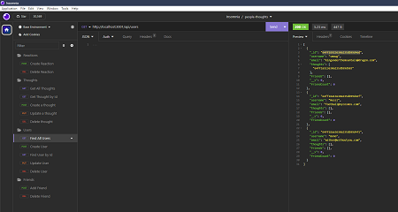
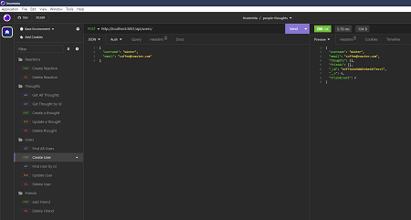
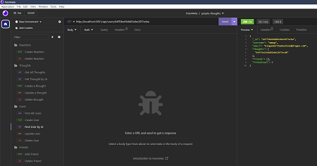
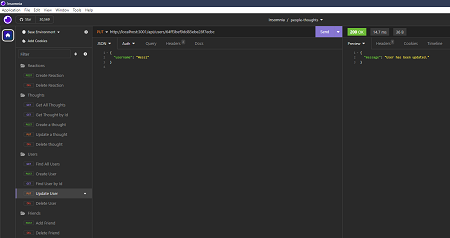
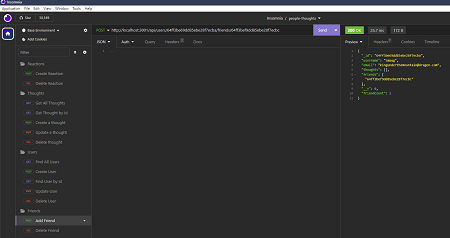

# People Thoughts API

 

## Table of Contents
  - [Description](#description)
  - [Installation](#installation)
  - [Usage](#usage)
  - [License](#license)
  - [Questions](#questions)

## Description
This challenge is called the NoSQL Challenge as it is accessing and managing a non-SQL database. In this case, the database is MongoDB. The advantages of using MongoDB is the speed in which it can work with large amounts of data, as well as the flexibility if offers due to having unstructured data.

This project delves into the development of an API designed around a social network application. Functionality includes creating users, finding specific users, updating user data, and deleting users. User functionality includes creating and removing friends; posting, updating and removing thoughts; and lastly posting and removing reactions to the posted thoughts.

This project utilizes Express for routing, a MongoDB database, and the Mongoose ODM (Object Data Modeling).

## Installation
Utilizes npm packages Express and Mongoose

## Usage
The application is invoked by using the npm start command from the command-line interface.

Demo Video: [LeeSochay People Thoughts API Demo](https://drive.google.com/file/d/1NVcY7j43z1C7HFH-SiuxkPL6zQ6ElMue/view)

Get All Users\

Create a User\

Get a User by Id\

Update a User\

Add a Friend\

## License
MIT License
A short and simple permissive license with conditions only requiring preservation of copyright and license notices. Licensed works, modifications, and larger works may be distributed under different terms and without source code. Please refer to [License: MIT](https://choosealicense.com/licenses/mit/) for more information.

## Questions
My GitHub username is leesochay and you can link to my profile at https://github.com/leesochay.  
For any questions, please feel free to email me at sochaylee@gmail.com
